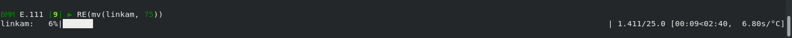

Ophyd Class
===========

To start, we want to derive our Linkam class from Ophyd's PVPositioner
class.  This will allow us to treat the Linkam stage like any other
positioner.  Specifically, this will allow us to *move* to a new
temperature in the same way that we move a translation stage.  At the
bsui terminal, this means we will get a progress bar and a time
estimate for completion of the move.  Most importantly, the move will
block plan execution until the change of temperature is completed.

Here's the boilerplate for the top of the class definition.

.. code-block:: python
   :linenos:

     from ophyd import Component as Cpt, EpicsSignal, EpicsSignalRO
     from ophyd import PVPositioner
     
     class Linkam(PVPositioner):
        '''An ophyd wrapper around the Linkam T96 controller
        '''

This is then followed by the list of components.

Following `the example from the Ophyd documentation
<https://blueskyproject.io/ophyd/positioners.html#pvpositioner>`__, we
need to add a ``readback`` and a ``setpoint`` attribute so the
positioner can know where it is and where it's going.

.. code-block:: python
   :linenos:

     from ophyd import Component as Cpt, EpicsSignal, EpicsSignalRO
     from ophyd import PVPositioner
     
     class Linkam(PVPositioner):
        '''An ophyd wrapper around the Linkam T96 controller
        '''

        readback = Cpt(EpicsSignalRO, 'TEMP')
        setpoint = Cpt(EpicsSignal, 'SETPOINT:SET')
        status_code = Cpt(EpicsSignal, 'STATUS')

The tricky part is specifying the ``done`` signal.  There is not a PV
which specifically and only reports when the temperature is at the set
point.  Instead, it is buried in ``status_code`` (which I have renamed
from the last section, for reasons which will become apparent shorty).

Doing this:

.. code-block:: python

   linkam.status_code.get()

returns a float like ``4.0`` or ``6.0``.  Kind of confusing...

The way to deal with this number is to first convert it to an integer,
then interpret it in a bit-wise context.

=====  ============================
 bit    meaning
=====  ============================
 1      an error has occurred
 2      at set point
 4      heater is on
 8      LN2 pump is on
 16     LN2 pump is in auto mode
=====  ============================

So, if

.. code-block:: python

   linkam.status_code.get() & 2 == 2

Then the temperature is at its set point.

Here is how we encode this in Ophyd.  We need to create a
DerivedSignal which is used to extract the 2 bit from the
``status_code`` attribute.

.. code-block:: python
   :linenos:

     from ophyd import Component as Cpt, EpicsSignal, EpicsSignalRO
     from ophyd import PVPositioner

     from ophyd.signal import DerivedSignal

     class AtSetpoint(DerivedSignal):
         '''A signal that does bit-wise arithmetic on the Linkam's status code'''
         def __init__(self, parent_attr, *, parent=None, **kwargs):
            code_signal = getattr(parent, parent_attr)
            super().__init__(derived_from=code_signal, parent=parent, **kwargs)

        def inverse(self, value):
            if int(value) & 2 == 2:
                return 1
            else:
                return 0

        def forward(self, value):
            return value

     class Linkam(PVPositioner):
        '''An ophyd wrapper around the Linkam T96 controller
        '''

        readback = Cpt(EpicsSignalRO, 'TEMP')
        setpoint = Cpt(EpicsSignal, 'SETPOINT:SET')
        status_code = Cpt(EpicsSignal, 'STATUS')
	done = Cpt(AtSetpoint, parent_attr = 'status_code')

In short, ``linkam.done`` will return 0 when the temperature is
not at he set point and 1 when it has reached the set point.  This
class now meets enough of the semantic needs of the PVPositioner class
that it can be used in a bluesky plan.

With this, it is now possible to do 

.. code-block:: python

   RE(mv(linkam, 75))

and see something like this at the bsui terminal:

.. _fig-progressbar:

   A bluesky progress bar as the Linkam stage heats up

The final version of the ophyd class `can be found here
<https://github.com/NSLS-II-BMM/profile_collection/blob/master/startup/BMM/linkam.py>`__
at BMM's GitHub site.  In the next section, I will explain some of the
additional features written into the class.

